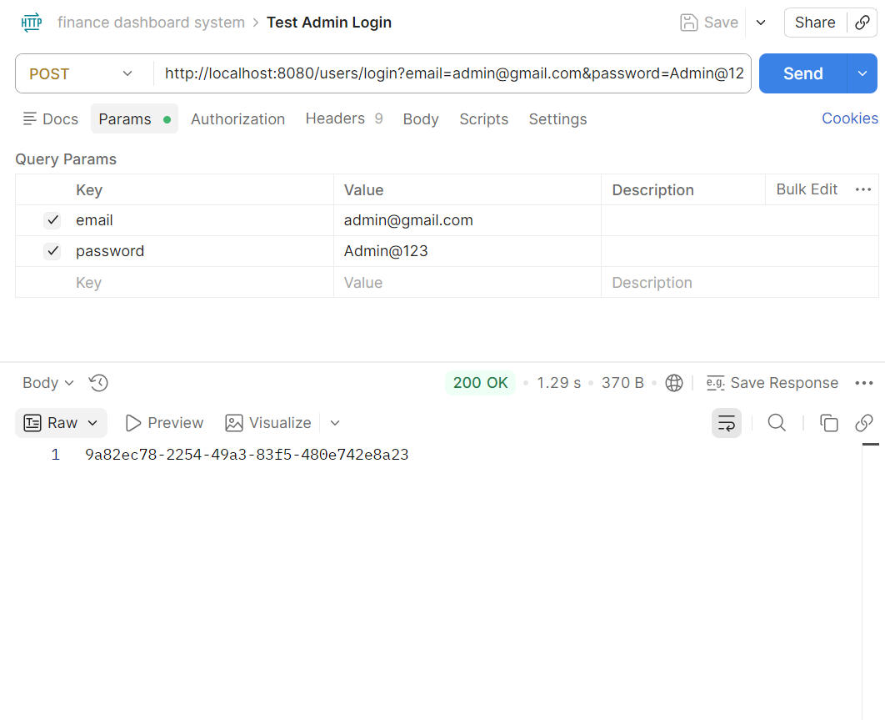
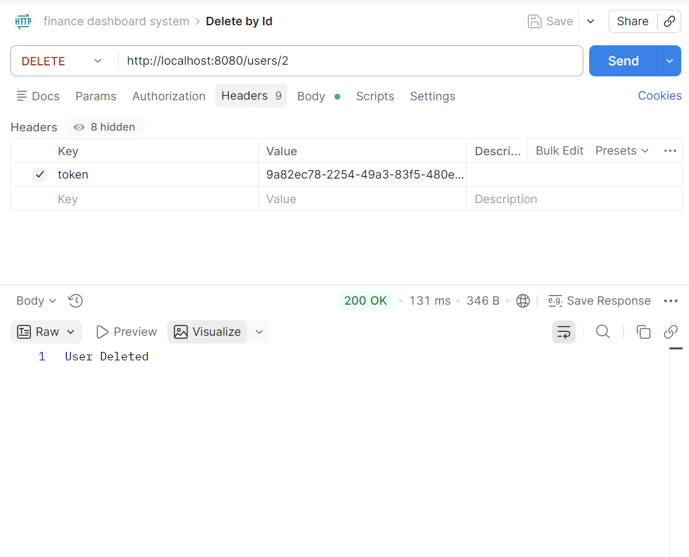

# Finance Data Processing and Access Control Backend

## Project Description
This project is a backend system for a finance dashboard that allows **role-based access** to financial entries. Users can **view, create, update, and delete financial records** based on their assigned role. The backend also supports **dashboard summaries**, enforces **strong validation**, and provides **authentication and access control** to ensure secure operations.

## Tech Stack

- **Language:** Java  
- **Framework:** Spring Boot 
- **Database:** MySQL 
- **Version Control:** Git & GitHub  
- **API Testing:** Postman 

## Features 

### 1. User and Role Management
- **User CRUD Operations:** Create, read, update, delete users.
- **Role-based Access:**  
  - **Viewer:** Can view dashboard summaries and financial entries.  
  - **Analyst:** Can view records and summaries.  
  - **Admin:** Full access to create, update, delete users and financial records.
- **Active/Inactive Users:** Only active users can login; inactive users are blocked.
- **Authentication & Authorization:**  
  - JWT-style token generation on login.
  - Logout invalidates the token.
- **Password Management:**  
  - Password validation on creation and update (min 6 chars, uppercase, lowercase, number, special character).  
  - Change password functionality with old password verification.

### 2. Financial Records Management
- **CRUD Operations on Entries:**  
  - Create, view, update, and delete financial entries.  
  - Each entry includes: Amount, Type (Income/Expense), Category, Date, Notes.
- **Filtering:**  
  - Filter entries by date, type, or category for easy reporting.
- **Enhanced Features:**  
  - Optional fields validated properly.  
  - Clean and safe DTOs (`EntryDTO` and `SafeUserDTO`) to prevent exposing sensitive data.

### 3. Dashboard Summary APIs
- **Summary Metrics:**  
  - Total Income  
  - Total Expenses  
  - Net Balance  
  - Category-wise totals  
  - Recent activities  
  - Monthly or weekly trends
- **Role-based Access:** Only allowed roles can access summary endpoints.

### 4. Validation and Error Handling
- **Input Validation:** Strong validation for user input, passwords, and financial entries.
- **Error Responses:** Clear, structured error messages with proper HTTP status codes (400, 401, 403, 404).

### 5. Access Control Logic
- **Role Enforcement:**  
  - Viewers cannot create/update/delete records.  
  - Analysts can view but not modify records.  
  - Admins have full control.
- **Security:** Tokens used to restrict access and verify user identity.

### 6. Enhanced Features
- **Safe DTOs:** Expose only necessary fields for security.   
- **Clean Architecture:** Separation of controllers, services, repositories, and DTOs for maintainability.  
- **Password Encoder:** BCrypt used for storing hashed passwords.  
- **Detailed API Endpoints Ready:** Supports easy Postman testing.

## Project Structure

```
com/financesystem/finance
│
├── config
│   ├── PasswordConfig.java        # Configures password encoder (BCrypt)
│   └── SecurityConfig.java        # Handles security settings, roles, and authentication
│
├── controller
│   ├── EntryController.java       # REST endpoints for financial entries (CRUD + filtering)
│   └── UserController.java        # REST endpoints for user management and authentication
│
├── dto
│   ├── EntryDTO.java              # Data transfer object for creating/updating entries
│   ├── UserDTO.java               # Data transfer object for creating/updating users
│   └── SafeUserDTO.java           # Safe representation of user without sensitive fields
│
├── entity
│   ├── Entry.java                 # JPA entity representing a financial entry
│   └── User.java                  # JPA entity representing a system user
│
├── exception
│   ├── BadRequestException.java   # Handles 400-level errors
│   ├── ForbiddenException.java    # Handles 403 errors
│   └── ResourceNotFoundException.java # Handles 404 errors
│
├── repository
│   ├── EntryRepository.java       # JPA repository for financial entries
│   └── UserRepository.java        # JPA repository for users
│
├── service
│   ├── EntryService.java          # Interface defining financial entry operations
│   ├── EntryServiceImpl.java      # Service implementation for financial entries
│   ├── UserService.java           # Interface defining user operations
│   └── UserServiceImpl.java       # Service implementation for user management
│
├── FinanceApplication.java        # Main Spring Boot application starter
└── application.properties         # Configuration file (DB, JPA, etc.)
```

## Setup / Installation Instructions

Follow these steps to set up and run the Finance Data Processing and Access Control Backend locally.

### 1. Prerequisites
- **Java JDK 17+** installed and configured in `PATH`.
- **Maven** installed and configured.
- **MySQL** installed and running.
- **Postman** for testing APIs.

### 2. Clone the Repository
- Clone repo
```java
git clone https://github.com/NikitaAnilPawar-02/Finance-Data-Processing-and-Access-Control-Backend.git 
```
- Change directory
```java
cd Finance-Data-Processing-and-Access-Control-Backend
```

### 3. Database Setup
- Open MySQL Workbench or any MySQL client.
- Create the database: 
```java
CREATE DATABASE finance_db;
```

### 4. Configure Application Properties
- Edit `src/main/resources/application.properties` to match your MySQL credentials:

### 5. Build the Project
- Use Maven to build the project:
```java
mvn clean install
```

### 6. Run the Application
- Run the Spring Boot application: ``` mvn spring-boot:run ```
- Or run the main class directly from your IDE: com.financesystem.finance.FinanceApplication

### 7. Verify the Backend
- Once running, the backend is accessible at: http://localhost:8080/
- You can use Postman or any HTTP client to test the APIs (see API documentation section below).

## API Documentation

This section lists all available backend endpoints for the Finance Data Processing and Access Control system.

---

### **Authentication & User Management**

#### 1. Login
- **Endpoint:** `POST /users/login`
- **Description:** Authenticates a user and returns a token.
- **Request Parameters (query):**
  - `email` (string, required)
  - `password` (string, required)
- **Response:**
  "eyJhbGciOiJIUzI1NiIsInR5cCI6IkpXVCJ9..."
- **Response Example:**
 

* **Roles:** All users

---

#### 2. Create User

* **Endpoint:** `POST /users`
* **Description:** Creates a new user (admin only).
* **Request Body (JSON):**

  ```json
  {
    "name": "John Doe",
    "email": "john@example.com",
    "password": "securepassword",
    "role": "ANALYST"
  }
  ```
* **Response:**

  ```
  User Created
  ```
- **Response Example:**
 

* **Roles:** Admin

---

#### 3. Get All Users

* **Endpoint:** `GET /users`
* **Description:** Returns a list of all users with safe info.
* **Response Example:**

  ```json
  [
    {
      "id": 1,
      "name": "John Doe",
      "email": "john@example.com",
      "role": "ANALYST"
    }
  ]
  ```
  - **Response Example:**
 

* **Roles:** Admin

---

#### 4. Get User by Email

* **Endpoint:** `GET /users/email?email=<email>`
* **Description:** Get safe details of a specific user.
* **Response Example:**

  ```json
  {
    "id": 1,
    "name": "John Doe",
    "email": "john@example.com",
    "role": "ANALYST"
  }
  ```
- **Response Example:**
 
* **Roles:** Admin

---

#### 5. Delete User

* **Endpoint:** `DELETE /users/{id}`
* **Description:** Deletes a user by ID.
* **Response:** `User Deleted`
* - **Response Example:**
 
* **Roles:** Admin

---

#### 6. Update Profile

* **Endpoint:** `PUT /users/profile?name=<name>&email=<email>`
* **Description:** Updates the logged-in user's profile.
* **Response:** `Profile Updated`
* **Roles:** All users (self)

---

#### 7. Change Password

* **Endpoint:** `PUT /users/password?oldPassword=<old>&newPassword=<new>`
* **Description:** Change password for the logged-in user.
* **Response:** `Password Changed`
* **Roles:** All users (self)

---

#### 8. Logout

* **Endpoint:** `POST /users/logout`
* **Description:** Logs out the current user.
* **Response:** `Logged out successfully`
* **Roles:** All users

---

### **Financial Entries Management**

#### 1. Create Entry

* **Endpoint:** `POST /entries`
* **Description:** Creates a new financial entry.
* **Request Body (JSON):**

  ```json
  {
    "amount": 1000,
    "type": "INCOME",
    "category": "Salary",
    "date": "2026-04-05",
    "notes": "April salary"
  }
  ```
* **Response:** `Entry Created`
* **Roles:** Admin

---

#### 2. Update Entry

* **Endpoint:** `PUT /entries/{id}`
* **Description:** Updates an existing entry.
* **Response:** `Entry Updated`
* **Roles:** Admin

---

#### 3. Delete Entry

* **Endpoint:** `DELETE /entries/{id}`
* **Description:** Deletes an entry by ID.
* **Response:** `Entry Deleted`
* **Roles:** Admin

---

#### 4. Get All Entries

* **Endpoint:** `GET /entries`
* **Description:** Fetch all financial entries.
* **Roles:** All users

---

#### 5. Filter by Type

* **Endpoint:** `GET /entries/type?type=<INCOME/EXPENSE>`
* **Description:** Fetch entries by type.
* **Roles:** All users

---

#### 6. Filter by Category

* **Endpoint:** `GET /entries/category?category=<category>`
* **Roles:** All users

---

#### 7. Filter by Date

* **Endpoint:** `GET /entries/date?date=<YYYY-MM-DD>`
* **Roles:** All users

---

#### 8. Filter by Date Range

* **Endpoint:** `GET /entries/date-range?start=<YYYY-MM-DD>&end=<YYYY-MM-DD>`
* **Roles:** All users

---

#### 9. Dashboard Summary

* **Endpoint:** `GET /entries/summary`
* **Description:** Returns total income, total expense, and net balance.
* **Response Example:**

  ```json
  {
    "totalIncome": 5000,
    "totalExpense": 2000,
    "netBalance": 3000
  }
  ```
* **Roles:** All users

---

#### 10. Category-wise Summary

* **Endpoint:** `GET /entries/category-summary`
* **Roles:** All users

---

#### 11. Monthly Summary

* **Endpoint:** `GET /entries/monthly-summary?year=2026&month=4`
* **Roles:** All users

---

#### 12. Yearly Summary

* **Endpoint:** `GET /entries/yearly-summary?year=2026`
* **Roles:** All users

---

#### 13. Recent Entries

* **Endpoint:** `GET /entries/recent?limit=5`
* **Roles:** All users

---

#### 14. Paged Entries

* **Endpoint:** `GET /entries/paged?page=0&size=10`
* **Roles:** All users
* **Description:** Supports pagination for large datasets.

---

## Assumptions & Initial Setup
- The system requires at least one **ADMIN user** to perform privileged operations such as creating users and managing financial entries.
- Currently, the first admin user must be **manually inserted into the database** before using the system.
- This is required because all user creation endpoints are restricted to ADMIN role.

### Initial Admin Setup (Required)

1. Generate an encrypted password using BCrypt.
2. Insert an admin user into the database manually:

```sql
INSERT INTO user (name, email, password, active, role)
VALUES ('Admin', 'admin@gmail.com', '<encrypted_password>', true, 'ADMIN');
````

3. Use these credentials to log in:

   * Email: `admin@gmail.com`
   * Password: (your original password before encryption)

### Note

In a production-ready system, this would be handled by:

* Automatic admin seeding during application startup, OR
* A secure initial registration flow

